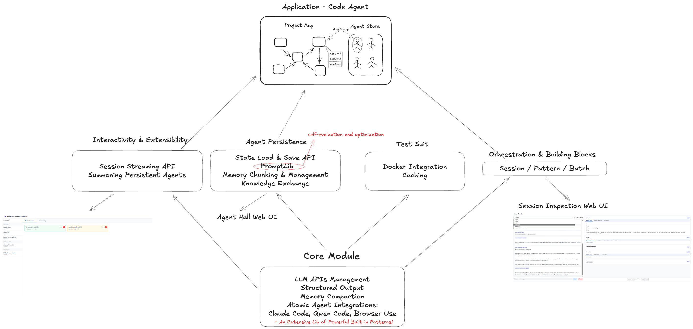

# The Story of PolyCLI

## Why Multi-Agent?

AI agents are how AI becomes economically useful. Devin codes. ElevenLabs voices handle customer calls. Replit Agent builds apps. The market doesn't buy models - it buys agents that do jobs.

But scale up the ambition. What about building an entire codebase from scratch? Conducting scientific research with iterative experiments and evolving hypotheses? Shipping production systems with testing, documentation, and deployment?

Single agents work until they don't.

Three thresholds where they break:
1. **Context**: Information exceeds working memory
2. **Performance**: Even within limits, quality drops sharply after the sweet spot
3. **Time**: Sequential processing becomes the bottleneck

Past any threshold, forcing everything through one agent doesn't make it more capable - it makes it incoherent.

Multiple specialized agents seem obvious. But we don't want to orchestrate raw API calls directly.

Modern coding agents (Claude Code, Gemini CLI...) aren't just LLMs with tool access - they're complete substrates that handle file operations, execution, error recovery. They do the grunt work so agents can focus on their actual role. We don't hire neurons; we hire people. We don't orchestrate capabilities; we organize expertise.

What creates expertise? Roles. Each role is a complete system: instructions that shape behavior, knowledge that provides context, specific toolsets for the task, even different models when needed. 

We envision effective agent systems as fractal structures - clear macro-level organization with infinitely refinable micro-level details. Teams contain specialists, specialists execute patterns, patterns invoke sub-agents when needed. The same organizational principles apply at every scale.

This organizational view explains why most multi-agent frameworks fail. They focus on agent communication - message passing, delegation, consensus. But organizations don't succeed because of communication protocols. They succeed through infrastructure: reproducible processes, debuggable failures, composable units of work, shared knowledge and experience.

That's what's missing.

## 1. Where things get tricky

Are agent systems hard to build? Not always.
Agent systems, by prevalent definition, involve multiple LLM calls, tool uses, and the information passing between these LLMs and tools.
But with our current toolset, the difficulty of building them varies dramatically.

### Simple Agents
These are the currently major types of "simple" agent systems:
1. A single agent + a few tools, each tool for a specific type of application. Depending on the importance of tools, it's between "a tool-augmented LLM" and "an LLM acting as the router to tools"
2. DAG agents with no "side-effect" (most Dify, Coze apps)
3. Agent + tools + a while loop (yes, *Claude Code is simple*. and that's why it's so successful with current tech stacks.)
4. Multi-agents systems that are created for fun/simulation instead of task-driven.

### Hard Agents
Here are the types of "hard" agents systems:
1. Agents that need to interact with a complex, obscure environment, designed originally for humans only. e.g browser-use.
2. Agents that need to finish a task end-to-end (with little human supervision!) which takes a very long sequence of steps and:
- Has a broad question scope.
- Has no/little pre-defined routine. 
- The next step depends heavily on the previous step - i.e. it's dynamic, able to change its own inertia when needed.
Typical tasks include:
- Build a software from scratch. (Which current code agents can't do.)
- Write a long novel.
- Hard problem solving & Scientific research (e.g. IMO questions [1])
3. Orchestrate a bunch of agents running in parallel but still highly inter-dependent.

There are already plenty of frameworks that allow you to build simple agents.
But very few of them can make truly effective, hard agents. No wonder why people are shouting "stop building agents".[2]
Most times, people may ask, "if a single agent can already solve the problem with 70% quality" then why bother improving on the edge with a multiple agents system?

My answer to this: because we are not "improving the edge", we want to genuinely solve problems at a new level of quality and reliability. And that might change a lot, a lot of things.

But how? It's trivial to make multi-agents work faster than a single agent. But it's non-trivial to make them work *better*.

## 2. Problems

We've spotted the 4 most fundamental problems of multi-agent engineering.

### Debugging
LLM calls are slow, random, unreliable.
When using tools, they become an even more unstable neuro-symbolic system.

Since LLMs have incredibly great input flexibility, programming errors in the system can be fixed, but can also be covered. And accumulated.

### Unification of Different forms of atomic agents
DeepResearch, Claude Code, Browser-use, LLMs with various structured output... what if they could all work together?

### They are ephemeral
Every time you start a script, agents are born. When it ends, they die. Their accumulated knowledge, their learned patterns, their understanding of your codebase - all lost. Tomorrow, you'll teach the same agent the same context again. And again. And again.

We've already seen some effort put into it, like ChatGPT's web version and Claude Code's CLAUDE.md.

### Composability
Mathematics flourishes because each theorem can be reused by another one.
Then what are the "theorems" for our agent world?

## 3. How do we scale it up

PolyCLI is a unified Python interface for orchestrating AI agents that solves the fundamental problems preventing multi-agent systems from working in production. Here's how PolyCLI's innovations address these challenges:



### Solution 1: Time-Travel Debugging with Cache-Bound Side Effects
PolyCLI introduces deterministic replay through comprehensive caching. Every LLM call is cached with its complete state transformation. This creates a "Jupyter notebook style" experience for agent system live coding - you can jump to any checkpoint, modify code, and re-run from that point with instant cache hits for unchanged operations.

We can bind side effects to cache state to ensure deterministic replay:

```python
with agent.run("analyze code") as result:
    # Validation and ephemeral effects (RAM) - always run
    validate_syntax(result.code)
    metrics.record(result.stats)
    
    # Persistent effects - only on cache miss
    if not result.cached:
        write_file("analysis.md", result)
```

This pattern ensures side effects only occur on first execution, the block validates LLM output correctness, and failures prevent caching - creating a database of validated truths. Like Jupyter cells that can be re-executed at will, agent workflows become explorable and interactive rather than opaque sequential processes. Combined with the auto-generated web monitor UI, you get real-time visibility into agent execution, can pause/resume workflows, and even inject messages mid-stream.

### Solution 2: Late-Binding Backend Selection
Instead of locking agents to specific backends, PolyCLI's `PolyAgent` chooses the backend at runtime. A unified `MessageList` maintains conversation continuity while backends switch dynamically between Claude Code, Qwen Code, SWE-Agent, or any model with structured output requirements. The same agent can morph between full coding assistants and lightweight structured extractors as needed.

### Solution 3: Agent Persistence
Agents become durable entities that accumulate knowledge across sessions:
- **Agent Hall**: A repository of long-lived agents with accumulated knowledge
- **Agent Inspection & Knowledge Distillation**: Extract and transfer learned patterns between agents
- **Agent Versioning**: Track agent evolution over time
- **Backend Server Framework**: Expose agents as APIs for external applications

These agents persist their state, remember past interactions, and grow more capable over time rather than starting fresh each session.

### Solution 4: Patterns as Composable Function Units
The `@pattern` decorator creates composable primitives that differ fundamentally from graph-based workflows. While graphs are typically designed for specific applications with rigid input/output contracts, patterns are functions that can:
- Take agents themselves as inputs
- Compose arbitrarily complex workflows
- Handle side effects naturally through standard programming constructs
- Be versioned, tested, and reused across projects

Your `code_review` pattern from one project becomes a building block for the next, creating a growing library of battle-tested components.

## The Future

How do we build a self-evolving system?
What about prompt auto-optimization on a dynamic SP-graph?

---

[1] Huang, Y., & Yang, L. F. (2025). Gemini 2.5 Pro Capable of Winning Gold at IMO 2025. arXiv preprint arXiv:2507.15855.
[2] https://decodingml.substack.com/p/stop-building-ai-agents
