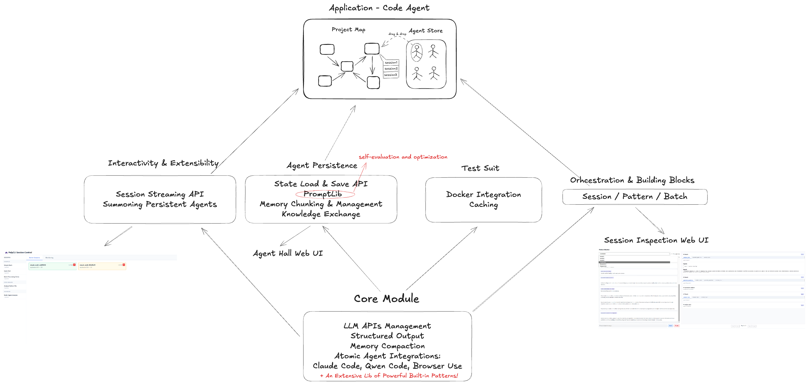

# PolyCLI 的故事

## 为什么需要多智能体？

AI 智能体是 AI 产生经济价值的方式。Devin 编程，ElevenLabs 语音处理客户电话，Replit Agent 构建应用。市场不买模型 - 它买能干活的智能体。

但当野心扩大时呢？从零开始构建整个代码库？进行迭代实验和演化假设的科学研究？交付包含测试、文档和部署的生产系统？

单智能体能用，直到不能用为止。

它们崩溃的三个阈值：
1. **上下文**：信息超过工作内存
2. **性能**：即使在限制内，质量在最佳点后急剧下降
3. **时间**：串行处理成为瓶颈

超过任何阈值，强行让一个智能体处理所有事情不会让它更强大 - 只会让它混乱。

多个专门的智能体似乎是显而易见的选择。但我们不想直接编排原始 API 调用。

现代编码智能体（Claude Code、Gemini CLI...）不仅仅是带工具访问的 LLM - 它们是处理文件操作、执行、错误恢复的完整基础设施。它们做脏活累活，让智能体专注于实际角色。我们不雇佣神经元；我们雇佣人。我们不编排能力；我们组织专业知识。

是什么创造了专业知识？角色。每个角色都是一个完整的系统：塑造行为的指令、提供上下文的知识、针对任务的特定工具集，甚至在需要时使用不同的模型。

我们设想有效的智能体系统是分形结构 - 清晰的宏观层面组织，无限可细化的微观层面细节。团队包含专家，专家执行模式，模式在需要时调用子智能体。相同的组织原则适用于每个尺度。

这种组织观点解释了为什么大多数多智能体框架失败。它们专注于智能体通信 - 消息传递、委托、共识。但组织的成功不是因为通信协议。它们通过基础设施成功：可重现的流程、可调试的失败、可组合的工作单元、共享的知识和经验。

这就是缺失的部分。

## 1. 棘手的地方

构建智能体系统难吗？并非总是如此。
按照普遍定义，智能体系统涉及多个 LLM 调用、工具使用，以及这些 LLM 和工具之间的信息传递。
但使用我们当前的工具集，构建难度差异很大。

### 简单智能体
这些是当前"简单"智能体系统的主要类型：
1. 单个智能体 + 几个工具，每个工具针对特定类型的应用。根据工具的重要性，它介于"工具增强的 LLM"和"作为工具路由器的 LLM"之间
2. 没有"副作用"的 DAG 智能体（大多数 Dify、Coze 应用）
3. 智能体 + 工具 + while 循环（是的，*Claude Code 很简单*。这就是为什么它在当前技术栈中如此成功。）
4. 为娱乐/模拟而非任务驱动创建的多智能体系统。

### 困难智能体
这些是"困难"智能体系统的类型：
1. 需要与复杂、晦涩的环境交互的智能体，原本只为人类设计。例如 browser-use。
2. 需要端到端完成任务的智能体（几乎不需要人类监督！），需要很长的步骤序列，并且：
- 有广泛的问题范围。
- 没有/很少预定义的例程。
- 下一步严重依赖于上一步 - 即它是动态的，需要时能够改变自己的惯性。
典型任务包括：
- 从零开始构建软件。（当前的代码智能体做不到。）
- 写长篇小说。
- 困难问题解决和科学研究（例如 IMO 问题 [1]）
3. 编排一堆并行运行但高度相互依赖的智能体。

已经有很多框架允许你构建简单的智能体。
但很少有框架能制作真正有效的困难智能体。难怪人们在喊"停止构建智能体"。[2]
很多时候，人们可能会问，"如果单个智能体已经能以 70% 的质量解决问题"，那为什么要费力用多智能体系统来改进边缘？

我的答案是：因为我们不是在"改进边缘"，我们想要真正在新的质量和可靠性水平上解决问题。这可能会改变很多很多事情。

但是怎么做？让多智能体比单个智能体工作得更快很简单。但让它们工作得*更好*却不简单。

## 2. 问题

我们发现了多智能体工程的 4 个最根本的问题。

### 调试
LLM 调用缓慢、随机、不可靠。
使用工具时，它们变成了更不稳定的神经符号系统。

由于 LLM 具有极大的输入灵活性，系统中的编程错误可以被修复，但也可以被掩盖。并且累积。

### 不同形式原子智能体的统一
DeepResearch、Claude Code、Browser-use、具有各种结构化输出的 LLM...如果它们都能一起工作呢？

### 它们是短暂的
每次启动脚本时，智能体诞生。结束时，它们死亡。它们积累的知识、学习的模式、对代码库的理解 - 全部丢失。明天，你将再次教同一个智能体相同的上下文。一次又一次。

我们已经看到一些努力，比如 ChatGPT 的网页版和 Claude Code 的 CLAUDE.md。

### 可组合性
数学之所以繁荣，是因为每个定理都可以被另一个重用。
那么我们智能体世界的"定理"是什么？

## 3. 我们如何扩展

PolyCLI 是一个统一的 Python 接口，用于编排 AI 智能体，解决了阻止多智能体系统在生产中工作的根本问题。以下是 PolyCLI 的创新如何解决这些挑战：


### 解决方案 1：带缓存绑定副作用的时间旅行调试
PolyCLI 通过全面缓存引入了确定性重放。每个 LLM 调用都与其完整的状态转换一起缓存。这为智能体系统实时编码创建了"Jupyter 笔记本风格"的体验 - 你可以跳转到任何检查点，修改代码，并从该点重新运行，未更改的操作获得即时缓存命中。

我们可以将副作用绑定到缓存状态以确保确定性重放：

```python
with agent.run("analyze code") as result:
    # 验证和临时效果（RAM）- 始终运行
    validate_syntax(result.code)
    metrics.record(result.stats)
    
    # 持久效果 - 仅在缓存未命中时
    if not result.cached:
        write_file("analysis.md", result)
```

这种模式确保副作用只在第一次执行时发生，代码块验证 LLM 输出的正确性，失败会阻止缓存 - 创建一个经过验证的真相数据库。就像可以随意重新执行的 Jupyter 单元格，智能体工作流变得可探索和交互式，而不是不透明的顺序过程。结合自动生成的 Web 监控 UI，你可以实时查看智能体执行，可以暂停/恢复工作流，甚至在中途注入消息。

### 解决方案 2：后期绑定后端选择
PolyCLI 的 `PolyAgent` 不是将智能体锁定到特定后端，而是在运行时选择后端。统一的 `MessageList` 维护对话连续性，同时后端在 Claude Code、Qwen Code、SWE-Agent 或任何具有结构化输出要求的模型之间动态切换。同一个智能体可以根据需要在完整的编码助手和轻量级结构化提取器之间变形。

### 解决方案 3：智能体持久化
智能体成为跨会话积累知识的持久实体：
- **智能体大厅**：具有累积知识的长期智能体仓库
- **智能体检查和知识蒸馏**：提取和转移智能体之间学习的模式
- **智能体版本控制**：跟踪智能体演变
- **后端服务器框架**：将智能体作为 API 暴露给外部应用

这些智能体持久化其状态，记住过去的交互，并随着时间的推移变得更有能力，而不是每次会话都重新开始。

### 解决方案 4：模式作为可组合函数单元
`@pattern` 装饰器创建的可组合原语与基于图的工作流根本不同。虽然图通常是为具有严格输入/输出契约的特定应用程序设计的，但模式是可以：
- 将智能体本身作为输入
- 组合任意复杂的工作流
- 通过标准编程结构自然处理副作用
- 在项目之间进行版本控制、测试和重用

你在一个项目中的 `code_review` 模式成为下一个项目的构建块，创建一个不断增长的经过实战测试的组件库。

## 未来

我们如何构建一个自我演化的系统？
动态 SP 图上的提示自动优化如何？

---

[1] Huang, Y., & Yang, L. F. (2025). Gemini 2.5 Pro Capable of Winning Gold at IMO 2025. arXiv preprint arXiv:2507.15855.

[2] https://decodingml.substack.com/p/stop-building-ai-agents
